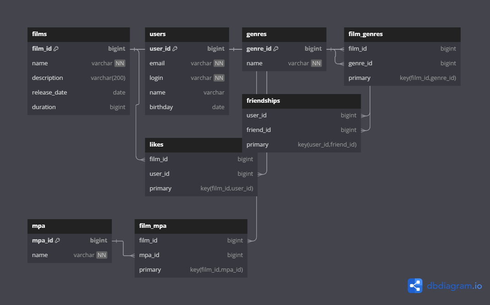

Схема базы данных для приложения Filmorate разработана для эффективного хранения и управления информацией о фильмах, пользователях и их взаимодействиях. Она включает в себя следующие основные компоненты:

1.Таблица films для хранения информации о фильмах, включая название, описание, дату выпуска и продолжительность.
2.Таблица users для хранения данных пользователей, таких как email, логин, имя и дата рождения.
3.Таблица genres и связующая таблица film_genres для реализации отношения многие-ко-многим между фильмами и жанрами.
4.Таблица mpa_ratings для хранения рейтингов MPA, связанная с таблицей films.
5.Таблица likes для отслеживания лайков пользователей к фильмам.
6.Таблица friendships для управления отношениями дружбы между пользователями, включая статус дружбы.

Примеры SQL-запросов для основных операций приложения.

### Получение всех фильмов
Получение всех фильмов

SELECT * FROM films;

Получение всех пользователей

SELECT * FROM users;

Получение топ N наиболее популярных фильмов

SELECT f.*, COUNT(l.user_id) AS likes_count

FROM films f

LEFT JOIN likes l ON f.id = l.film_id

GROUP BY f.id

ORDER BY likes_count DESC

LIMIT N;

Получение списка общих друзей с другим пользователем

SELECT u.*

FROM users u

JOIN friendships f1 ON u.id = f1.friend_id

JOIN friendships f2 ON u.id = f2.friend_id

WHERE f1.user_id = :user_id1 AND f2.user_id = :user_id2

  AND f1.status = 'confirmed' AND f2.status = 'confirmed';
  

Добавление лайка фильму

INSERT INTO likes (film_id, user_id)

VALUES (:film_id, :user_id);

Добавление друга

INSERT INTO friendships (user_id, friend_id, status)

VALUES (:user_id, :friend_id, 'pending');

Подтверждение дружбы

UPDATE friendships

SET status = 'confirmed'

WHERE user_id = :friend_id AND friend_id = :user_id;

[Ссылка на онлайн-версию ER-диаграммы](https://dbdiagram.io/d/671bbd6d97a66db9a34a32d1)
